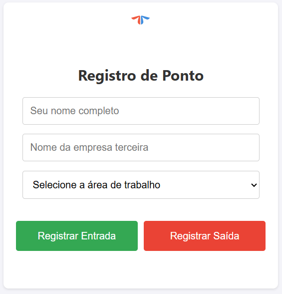
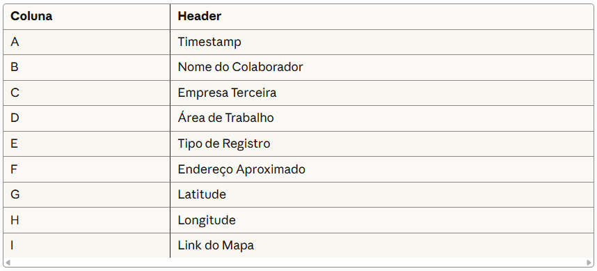

# Ponto Web App com Geolocalização

Um sistema simples de registro de ponto (Entrada e Saída) construído com Google Apps Script. A aplicação web é totalmente responsiva e projetada para ser usada em dispositivos móveis, capturando a localização GPS do colaborador no momento do registro.



> **Dica:** Tire um print da tela do seu app, suba a imagem para o GitHub e substitua o link acima.

## ✨ Funcionalidades

- **Registro de Entrada e Saída:** Botões claros e distintos para cada ação
- **Identificação do Colaborador:** Campos para nome, empresa terceira e área de atuação
- **Captura de Geolocalização:** Usa a API de Geolocalização do navegador para obter as coordenadas de Latitude e Longitude com alta precisão
- **Geocodificação Reversa:** Converte as coordenadas GPS em um endereço físico aproximado
- **Interface Personalizada:** Exibe o logo da empresa e possui um design limpo
- **Armazenamento Centralizado:** Todos os registros são salvos automaticamente em uma Planilha Google em tempo real
- **Link para o Mapa:** Gera um link clicável do Google Maps para cada registro

## 🛠️ Tecnologias Utilizadas

- **Backend:** Google Apps Script (`Código.gs`)
- **Frontend:** HTML5, CSS3, JavaScript (`Index.html`)
- **Banco de Dados:** Google Sheets
- **Serviços Google:**
  - `HtmlService` para servir a página web
  - `SpreadsheetApp` para interagir com a planilha
  - `Maps.newGeocoder()` para a geocodificação reversa

## 🚀 Como Configurar e Usar

Siga estes passos para implantar sua própria versão do aplicativo.

### 1. Configuração da Planilha Google

1. Crie uma nova Planilha Google
2. Renomeie a primeira aba (página) para `Registros`
3. Na primeira linha da aba `Registros`, crie os seguintes cabeçalhos, exatamente nesta ordem:



### 2. Configuração do Google Apps Script

1. Na sua Planilha Google, vá em **Extensões > Apps Script**
2. Apague o conteúdo do arquivo `Código.gs` padrão e cole o código do backend fornecido
3. Crie um novo arquivo HTML clicando no `+` ao lado de "Arquivos" e nomeie-o como `Index`
4. Apague o conteúdo do arquivo `Index.html` padrão e cole o código do frontend fornecido

### 3. Personalização (Opcional)

**Logo:** No arquivo `Index.html`, encontre a tag `` e substitua o `src` pelo link público do logo da sua empresa.

**Áreas de Trabalho:** No mesmo arquivo, encontre o elemento `<select id="area">` e edite as `<option>` para refletir as áreas da sua empresa.

### 4. Implantação (Deploy)

1. No editor do Apps Script, clique em **"Implantar" > "Nova implantação"**
2. Clique no ícone de engrenagem (⚙️) e selecione **"App da Web"**
3. Configure a implantação com as seguintes opções:
   - **Executar como:** "Eu (seu.email@exemplo.com)"
   - **Quem pode acessar:** "Qualquer pessoa com uma Conta do Google" ou "Qualquer pessoa"
4. Clique em **"Implantar"**
5. Autorize as permissões necessárias para o script (clicando em "Avançado" e "Acessar...")
6. Copie a URL do App da Web gerada. Este é o link para o seu aplicativo!

## 🔧 Como Usar o Aplicativo

1. Abra a URL do App da Web em um navegador (preferencialmente no celular)
2. Preencha seu nome, empresa e a área de trabalho
3. Clique em **"Registrar Entrada"** ou **"Registrar Saída"**
4. Permita que o navegador acesse sua localização quando solicitado
5. A confirmação do registro aparecerá na tela, e os dados serão salvos instantaneamente na sua Planilha Google

## 📋 Estrutura de Arquivo

```
.
├── Código.gs          # Backend em Google Apps Script
└── Index.html         # Frontend (HTML5, CSS3, JavaScript)
```

## 📝 Licença

Este projeto é fornecido como está para uso interno.

## 📞 Suporte

Em caso de dúvidas ou problemas durante a configuração, verifique:
- Se os cabeçalhos da planilha estão exatamente como especificado
- Se as permissões do Apps Script foram devidamente autorizadas
- Se o navegador tem permissão para acessar a geolocalização

